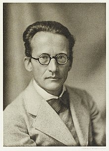
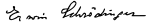

<table class="infobox biography vcard">
<tbody>
<tr>
<th colspan="2">

Erwin Schr&ouml;dinger

</th>
</tr>
<tr>
<td colspan="2"></td>
</tr>
<tr>
<th scope="row">Born</th>
<td>

Erwin Rudolf Josef Alexander Schr&ouml;dinger

 12 August 1887 

<a title="Vienna" href="https://en.wikipedia.org/wiki/Vienna">Vienna</a>,&nbsp;<a title="Austria-Hungary" href="https://en.wikipedia.org/wiki/Austria-Hungary">Austria-Hungary</a>

</td>
</tr>
<tr>
<th scope="row">Died</th>
<td>4 January 1961&nbsp;(aged&nbsp;73) 

<a title="Vienna" href="https://en.wikipedia.org/wiki/Vienna">Vienna</a>,&nbsp;<a title="Austria" href="https://en.wikipedia.org/wiki/Austria">Austria</a>

</td>
</tr>
<tr>
<th scope="row">Nationality</th>
<td class="category">Austrian</td>
</tr>
<tr>
<th scope="row">Citizenship</th>
<td class="category">

<ul>
<li><a title="Austrian nationality law" href="https://en.wikipedia.org/wiki/Austrian_nationality_law">Austria</a></li>
<li><a title="Irish nationality law" href="https://en.wikipedia.org/wiki/Irish_nationality_law">Ireland</a>&nbsp;(from 1948)</li>
</ul>

</td>
</tr>
<tr>
<th scope="row">Alma&nbsp;mater</th>
<td><a title="University of Vienna" href="https://en.wikipedia.org/wiki/University_of_Vienna">University of Vienna</a></td>
</tr>
<tr>
<th scope="row">Known&nbsp;for</th>
<td>

&nbsp;

<ul class="mw-collapsible-content">
<li><a title="Schr&ouml;dinger equation" href="https://en.wikipedia.org/wiki/Schr%C3%B6dinger_equation">Schr&ouml;dinger equation</a> <a title="Schr&ouml;dinger's cat" href="https://en.wikipedia.org/wiki/Schr%C3%B6dinger%27s_cat">Schr&ouml;dinger's cat</a> <a title="Cat state" href="https://en.wikipedia.org/wiki/Cat_state">Cat state</a> <a title="Schr&ouml;dinger method" href="https://en.wikipedia.org/wiki/Schr%C3%B6dinger_method">Schr&ouml;dinger method</a> <a title="Schr&ouml;dinger functional" href="https://en.wikipedia.org/wiki/Schr%C3%B6dinger_functional">Schr&ouml;dinger functional</a> <a title="Schr&ouml;dinger group" href="https://en.wikipedia.org/wiki/Schr%C3%B6dinger_group">Schr&ouml;dinger group</a> <a title="Schr&ouml;dinger picture" href="https://en.wikipedia.org/wiki/Schr%C3%B6dinger_picture">Schr&ouml;dinger picture</a> <a title="Schr&ouml;dinger field" href="https://en.wikipedia.org/wiki/Schr%C3%B6dinger_field">Schr&ouml;dinger field</a> <a title="M&oslash;ller&ndash;Plesset perturbation theory" href="https://en.wikipedia.org/wiki/M%C3%B8ller%E2%80%93Plesset_perturbation_theory#Rayleigh%E2%80%93Schr%C3%B6dinger_perturbation_theory">Rayleigh-Schr&ouml;dinger perturbation</a> <a title="Uncertainty principle" href="https://en.wikipedia.org/wiki/Uncertainty_principle">Robertson&ndash;Schr&ouml;dinger_uncertainty relations</a> <a title="Gisin&ndash;Hughston&ndash;Jozsa&ndash;Wootters theorem" href="https://en.wikipedia.org/wiki/Gisin%E2%80%93Hughston%E2%80%93Jozsa%E2%80%93Wootters_theorem">Schr&ouml;dinger&ndash;HJW theorem</a> <a title="Classical unified field theories" href="https://en.wikipedia.org/wiki/Classical_unified_field_theories">Schr&ouml;dinger's pure-affine theory</a> <a class="mw-redirect" title="Coherent states" href="https://en.wikipedia.org/wiki/Coherent_states">Coherent states</a> <a title="Energy level" href="https://en.wikipedia.org/wiki/Energy_level">Energy level</a> <a title="Entropy and life" href="https://en.wikipedia.org/wiki/Entropy_and_life">Entropy and life</a> <a title="Negentropy" href="https://en.wikipedia.org/wiki/Negentropy">Negentropy</a> <a title="Interpretations of quantum mechanics" href="https://en.wikipedia.org/wiki/Interpretations_of_quantum_mechanics">Interpretations of quantum mechanics</a> <a title="Qualia" href="https://en.wikipedia.org/wiki/Qualia">Qualia</a> <a title="Quantum biology" href="https://en.wikipedia.org/wiki/Quantum_biology">Quantum biology</a> <a title="Quantum entanglement" href="https://en.wikipedia.org/wiki/Quantum_entanglement">Quantum entanglement</a> <a title="Quantum superposition" href="https://en.wikipedia.org/wiki/Quantum_superposition">Quantum superposition</a> <a title="Quantum steering" href="https://en.wikipedia.org/wiki/Quantum_steering">Quantum steering</a> <a title="Zitterbewegung" href="https://en.wikipedia.org/wiki/Zitterbewegung">Zitterbewegung</a></li>
</ul>

</td>
</tr>
<tr>
<th scope="row">Spouse(s)</th>
<td>Annemarie Bertel (1920&ndash;1961)</td>
</tr>
<tr>
<th scope="row">Awards</th>
<td><a title="Matteucci Medal" href="https://en.wikipedia.org/wiki/Matteucci_Medal">Matteucci Medal</a>&nbsp;<small>(1927)</small> <a title="Nobel Prize in Physics" href="https://en.wikipedia.org/wiki/Nobel_Prize_in_Physics">Nobel Prize in Physics</a>&nbsp;<small>(1933)</small> <a title="Max Planck Medal" href="https://en.wikipedia.org/wiki/Max_Planck_Medal">Max Planck Medal</a>&nbsp;<small>(1937)</small></td>
</tr>
<tr>
<td colspan="2"><strong>Scientific career</strong></td>
</tr>
<tr>
<th scope="row">Fields</th>
<td class="category"><a title="Physics" href="https://en.wikipedia.org/wiki/Physics">Physics</a></td>
</tr>
<tr>
<th scope="row">Institutions</th>
<td>

<ul>
<li><a class="mw-redirect" title="University of Breslau" href="https://en.wikipedia.org/wiki/University_of_Breslau">University of Breslau</a></li>
<li><a class="mw-redirect" title="University of Z&uuml;rich" href="https://en.wikipedia.org/wiki/University_of_Z%C3%BCrich">University of Z&uuml;rich</a></li>
<li><a class="mw-redirect" title="Friedrich-Wilhelms-Universit&auml;t" href="https://en.wikipedia.org/wiki/Friedrich-Wilhelms-Universit%C3%A4t">Friedrich-Wilhelms-Universit&auml;t</a>, Berlin</li>
<li><a title="University of Oxford" href="https://en.wikipedia.org/wiki/University_of_Oxford">University of Oxford</a></li>
<li><a title="University of Graz" href="https://en.wikipedia.org/wiki/University_of_Graz">University of Graz</a></li>
<li><a title="Dublin Institute for Advanced Studies" href="https://en.wikipedia.org/wiki/Dublin_Institute_for_Advanced_Studies">Dublin Institute for Advanced Studies</a></li>
<li><a title="Ghent University" href="https://en.wikipedia.org/wiki/Ghent_University">Ghent University</a></li>
</ul>

</td>
</tr>
<tr>
<th scope="row"><a title="Thesis" href="https://en.wikipedia.org/wiki/Thesis">Thesis</a></th>
<td><a class="external text" href="https://www.zbp.univie.ac.at/schrodinger/dokumente/dissertationpromotion.htm" rel="nofollow"><em>&Uuml;ber die Leitung der Elektrizit&auml;t auf der Oberfl&auml;che von Isolatoren an feuchter Luft (On the conduction of electricity on the surface of insulators in humid air)</em></a>&nbsp;(1910)</td>
</tr>
<tr>
<th scope="row"><a title="Doctoral advisor" href="https://en.wikipedia.org/wiki/Doctoral_advisor">Doctoral advisor</a></th>
<td><a title="Friedrich Hasen&ouml;hrl" href="https://en.wikipedia.org/wiki/Friedrich_Hasen%C3%B6hrl">Friedrich Hasen&ouml;hrl</a></td>
</tr>
<tr>
<th scope="row">Other&nbsp;academic advisors</th>
<td><a title="Franz S. Exner" href="https://en.wikipedia.org/wiki/Franz_S._Exner">Franz S. Exner</a></td>
</tr>
<tr>
<th colspan="2">Signature</th>
</tr>
<tr>
<td colspan="2"></td>
</tr>
</tbody>
</table>
 

<strong>Erwin Rudolf Josef Alexander Schr&ouml;dinger</strong>&nbsp;(12 August 1887 &ndash; 4 January 1961), sometimes written as&nbsp;<strong>Erwin Schrodinger</strong>&nbsp;or&nbsp;<strong>Erwin Schroedinger</strong>, was a Nobel Prize-winning Austrian-Irish&nbsp;<a title="Physicist" href="https://en.wikipedia.org/wiki/Physicist">physicist</a>&nbsp;who developed a number of fundamental results in&nbsp;<a title="Quantum field theory" href="https://en.wikipedia.org/wiki/Quantum_field_theory">quantum theory</a>: the&nbsp;<a title="Schr&ouml;dinger equation" href="https://en.wikipedia.org/wiki/Schr%C3%B6dinger_equation">Schr&ouml;dinger equation</a>&nbsp;provides a way to calculate the&nbsp;<a title="Wave function" href="https://en.wikipedia.org/wiki/Wave_function">wave function</a>&nbsp;of a system and how it changes dynamically in&nbsp;<a title="Time in physics" href="https://en.wikipedia.org/wiki/Time_in_physics">time</a>.

In addition, he was the author of many works on various aspects of&nbsp;<a title="Physics" href="https://en.wikipedia.org/wiki/Physics">physics</a>:&nbsp;<a title="Statistical mechanics" href="https://en.wikipedia.org/wiki/Statistical_mechanics">statistical mechanics</a>&nbsp;and&nbsp;<a title="Thermodynamics" href="https://en.wikipedia.org/wiki/Thermodynamics">thermodynamics</a>, physics of dielectrics,&nbsp;<a class="mw-redirect" title="Colour theory" href="https://en.wikipedia.org/wiki/Colour_theory">colour theory</a>,&nbsp;<a class="mw-redirect" title="Electrodynamics" href="https://en.wikipedia.org/wiki/Electrodynamics">electrodynamics</a>,&nbsp;<a title="General relativity" href="https://en.wikipedia.org/wiki/General_relativity">general relativity</a>, and&nbsp;<a title="Cosmology" href="https://en.wikipedia.org/wiki/Cosmology">cosmology</a>, and he made several attempts to construct a&nbsp;<a title="Unified field theory" href="https://en.wikipedia.org/wiki/Unified_field_theory">unified field theory</a>. In his book&nbsp;<em><a title="What Is Life?" href="https://en.wikipedia.org/wiki/What_Is_Life%3F">What Is Life?</a></em>&nbsp;Schr&ouml;dinger addressed the problems of genetics, looking at the phenomenon of life from the point of view of physics. He paid great attention to the philosophical aspects of science, ancient and oriental philosophical concepts, ethics, and religion.&nbsp;He also wrote on philosophy and theoretical biology. He is also known for his "<a title="Schr&ouml;dinger's cat" href="https://en.wikipedia.org/wiki/Schr%C3%B6dinger%27s_cat">Schr&ouml;dinger's cat</a>" thought experiment.

 

<strong> Publications: </strong>

<ul>

 <li><a target="_blank" href="https://github.com/manjunath5496/Erwin-Schrodinger-Papers/blob/master/tst(222).pdf" style="text-decoration:none;">Collected Papers on Wave Mechanics</a></li>
                            
 <li><a target="_blank" href="https://github.com/manjunath5496/Erwin-Schrodinger-Papers/blob/master/tst(223).pdf" style="text-decoration:none;">Statistical Thermodynamics</a></li>

<li><a target="_blank" href="https://github.com/manjunath5496/Erwin-Schrodinger-Papers/blob/master/tst(224).pdf" style="text-decoration:none;"> Expanding Universes</a></li>

 <li><a target="_blank" href="https://github.com/manjunath5496/Erwin-Schrodinger-Papers/blob/master/tst(225).pdf" style="text-decoration:none;">My View of the World</a></li>
                            
 <li><a target="_blank" href="https://github.com/manjunath5496/Erwin-Schrodinger-Papers/blob/master/tst(226).pdf" style="text-decoration:none;">Space-Time Structure</a></li>

<li><a target="_blank" href="https://github.com/manjunath5496/Erwin-Schrodinger-Papers/blob/master/tst(227).pdf" style="text-decoration:none;">WHAT IS LIFE?</a></li>

<li><a target="_blank" href="https://github.com/manjunath5496/Erwin-Schrodinger-Papers/blob/master/tst(228).pdf" style="text-decoration:none;">The fundamental idea of wave mechanics [Nobel Lecture]</a></li>

                          
</ul>

 
